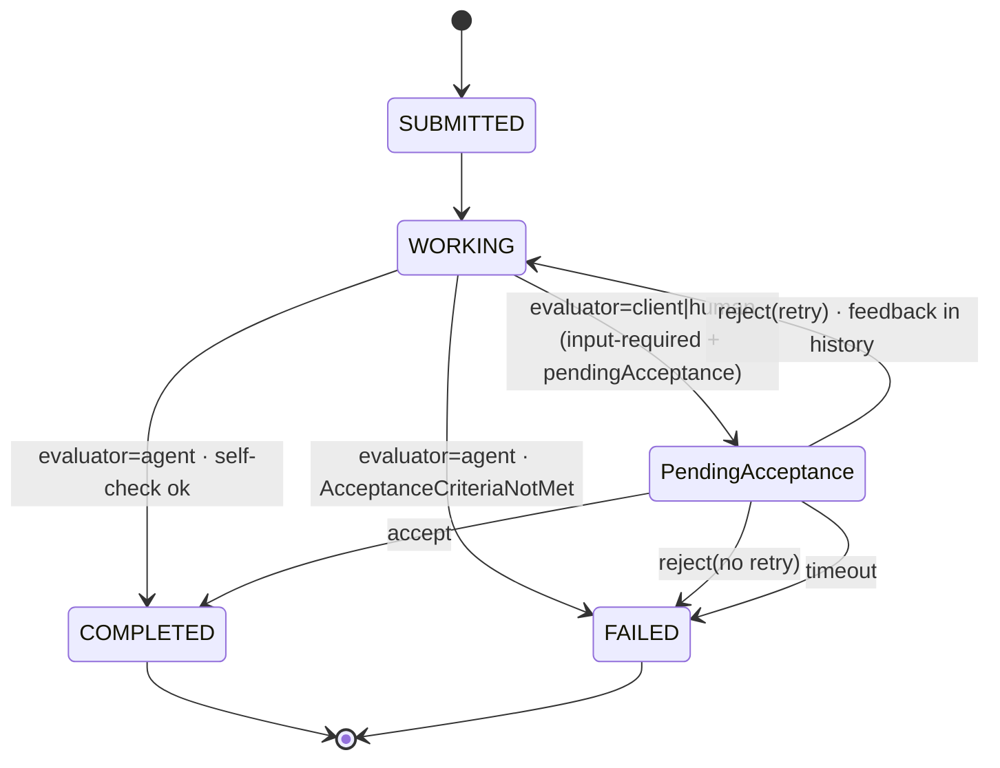

# A2A Protocol Extension: Acceptance Criteria (v1 Draft)

- **URI:** `https://github.com/sweengineeringlabs/a2a-proposal/tree/main/extension/experimental-ext-acceptance/v1`
  _(provisional draft identifier, resolvable at the staging repository. On Maintainer
  sponsorship the extension moves under `a2aproject` and the canonical URI is
  reassigned — a relocation that, per §3.1, warrants a fresh URI. Using the live
  draft location as the interim identifier follows the `experimental-ext-oid4vp-auth`
  precedent.)_
- **Type:** Profile + State Machine + Data Extension
- **Version:** 1.0.0 (Draft)
- **Status:** Experimental (proposed)
- **Authors:** Amu Hlongwane (Software Engineering Labs)
- **License:** Apache-2.0

> **Experimental:** This extension has experimental status — breaking changes are
> possible. See [A2A Extension and Protocol Binding Governance](https://a2a-protocol.org/latest/topics/extension-and-binding-governance/).

> **Rationale & alternatives** (why this exists, why an extension, why not core) live
> in the proposal: [`../../../proposal/proposal.md`](../../../proposal/proposal.md).
> This document is the normative specification only.

> **Requirements language.** The key words **MUST**, **MUST NOT**, **REQUIRED**,
> **SHALL**, **SHOULD**, **SHOULD NOT**, **MAY**, and **OPTIONAL** in this document
> are to be interpreted as described in [RFC 2119](https://tools.ietf.org/html/rfc2119).

> **Notation.** In wire examples the extension URI is written in full. Throughout
> prose, `{EXT}` is shorthand for the extension URI above; a metadata key written
> `{EXT}/criteria` is the URI with that suffix appended.

## Abstract

This extension adds a negotiated **acceptance gate** to A2A: a client declares
success criteria for a task, the agent parks finished output in a
**pending-acceptance** condition, and an authorized client or human **accepts** it
(→ `COMPLETED`) or **rejects** it with structured feedback (→ `WORKING`, same task,
preserving `contextId` and history). It is layered entirely through the extension
mechanism, with **no core-protocol changes**: no new `TaskState` value, no new
`Task`/`AgentCapabilities` fields, no new core RPCs.

## 1. Problem

Core A2A's `COMPLETED` means "the agent stopped," not "the output is acceptable,"
and offers no standard way to gate completion or to reject output with feedback and
retry the same task. Teams work around this out-of-band — validating artifacts
themselves and opening a fresh task when dissatisfied — which loses context and,
because every vendor invents its own convention, does not interoperate across a
client/agent boundary.

## 2. Declaration (Agent Card)

A supporting agent advertises the extension inside its existing
`AgentCapabilities.extensions[]` array — no new capability field:

```json
{
  "capabilities": {
    "extensions": [
      {
        "uri": "https://github.com/sweengineeringlabs/a2a-proposal/tree/main/extension/experimental-ext-acceptance/v1",
        "description": "Supports declared acceptance criteria, a pending-acceptance gate, and accept/reject with feedback before COMPLETED.",
        "required": false,
        "params": {
          "evaluators": ["client", "agent", "human"],
          "supportsArtifactSchema": true,
          "maxRejectionsCap": 10
        }
      }
    ]
  }
}
```

`params` lets the agent declare which evaluator modes and features it supports, so
clients can negotiate before sending criteria.

## 3. Activation (per request)

A client that wants the behavior **MUST** activate it on the request that creates
the task by including the extension URI in the `A2A-Extensions` header:

```
A2A-Extensions: https://github.com/sweengineeringlabs/a2a-proposal/tree/main/extension/experimental-ext-acceptance/v1
```

An agent that activates the extension **MUST** echo the URI in the response
`A2A-Extensions` header. If the agent does not echo the URI, the client **MUST**
assume the task will follow ordinary `WORKING → COMPLETED` semantics and **MUST
NOT** wait for a pending-acceptance gate. An agent that does not support this
extension **MUST** ignore both the header and any acceptance metadata, leaving
baseline behavior unchanged. This keeps the feature safe in mixed fleets — criteria
never silently change a task's lifecycle for an agent that cannot honor them.

### 3.1 Versioning

- The extension URI is the version identifier. A breaking change to the data
  schemas, flow, or `params` **MUST** be published under a new URI (e.g. `.../v2`).
- If a client requests a version the agent does not support, the agent **SHOULD**
  ignore the activation request and **MUST NOT** fall back to a different version.

## 4. Data

This extension defines three metadata keys, all namespaced under `{EXT}`, and has
**no dependencies** on other extensions:

| Key | On object | Carries |
|---|---|---|
| `{EXT}/criteria` | `Task` / creating `Message` | the `AcceptanceCriteria` object (§4.1) |
| `{EXT}/pendingAcceptance` | `TaskStatus.message` | the pending-acceptance flag (§5.1) |
| `{EXT}/decision` | accept/reject `Message` | the accept/reject `decision` object (§5.2) |

### 4.1 `AcceptanceCriteria`

Carried in `Task.metadata` (or supplied on the creating `Message.metadata`), keyed
by `{EXT}/criteria`:

```json
{
  "metadata": {
    "https://github.com/sweengineeringlabs/a2a-proposal/tree/main/extension/experimental-ext-acceptance/v1/criteria": {
      "description": "Valid JSON invoice matching the schema; total > 0.",
      "artifactSchema": { "...": "JSON Schema object" },
      "requiredArtifacts": ["invoice.json"],
      "evaluator": "human",
      "acceptanceTimeoutSeconds": 86400,
      "maxRejections": 3
    }
  }
}
```

| Field | Type | Meaning |
|---|---|---|
| `description` | string | Human/LLM-interpretable success condition. |
| `artifactSchema` | object (JSON Schema) | Schema that `application/json` artifact parts **MUST** validate against. |
| `requiredArtifacts` | string[] | `Artifact.name` values that **MUST** be present. |
| `evaluator` | enum: `client` \| `agent` \| `human` | Who gates completion (see §4.2). Default `client`. |
| `acceptanceTimeoutSeconds` | int | Max time in pending-acceptance before the agent transitions the task to `failed`. Omit = the server's implementation-defined default (finite; see §11), not unbounded. |
| `maxRejections` | int | Max reject→retry cycles before `failed`. Omit = the server's implementation-defined default (finite; see §11), not unbounded. |

> **`extensions` field.** `Message` and `Artifact` each carry a `repeated string
> extensions` field listing the URIs "present or contributed to" that object. Any
> `Message` carrying this extension's metadata (criteria, pending flag, or a
> decision) **MUST** also include `{EXT}` in its `extensions` array, so receivers can
> detect the contribution without scanning metadata keys.
>
> **State naming.** Examples use the JSON/REST string forms of states
> (`"input-required"`, `"working"`, `"canceled"`). The gRPC/proto transport uses the
> equivalent enum constants (`TASK_STATE_INPUT_REQUIRED`, etc.). No new constant is
> added on any transport.

### 4.2 The `evaluator` field

`evaluator` means strictly *who issues the accept/reject signal*:

- `client` — the orchestrator validates programmatically and sends accept/reject.
- `human` — the task waits for a human-issued accept/reject (surfaced out-of-band by
  the client).
- `agent` — the agent self-evaluates. **In this mode the agent does NOT enter
  pending-acceptance**; it either reaches `completed` (self-check passed) or `failed`
  with `AcceptanceCriteriaNotMet`.

On the wire, `client` and `human` are identical — both resolve via a `{EXT}/decision`
message from the client. The distinction is informational: it signals whether a human
is in the loop, which MAY affect timeout defaults and how the client surfaces the
task for review. Agents **MUST NOT** rely on it for access control (see §11).

## 5. Lifecycle and the accept/reject flow

### 5.1 The pending-acceptance condition (no new enum value)

When activated criteria require `client` or `human` evaluation, an agent that has
finished producing output **MUST NOT** transition to `completed`. It parks the task
in the existing `input-required` state and flags it:

```json
{
  "status": {
    "state": "input-required",
    "message": {
      "extensions": ["https://github.com/sweengineeringlabs/a2a-proposal/tree/main/extension/experimental-ext-acceptance/v1"],
      "metadata": {
        "https://github.com/sweengineeringlabs/a2a-proposal/tree/main/extension/experimental-ext-acceptance/v1/pendingAcceptance": true
      }
    }
  }
}
```

`input-required` is the anchor: the core "interrupted, awaiting a client action"
state, where the action is the accept/reject decision. Artifacts **MUST** be emitted
**before** this transition, so streaming and polling clients already have the output
to evaluate. Existing `TaskStatusUpdateEvent` / push-notification machinery fires on
this transition — no new webhook concept is needed.

### 5.2 Accept / reject via `message/send` (recommended)

Both signals are ordinary `message/send` calls on the same `taskId`/`contextId`,
carrying decision metadata keyed by `{EXT}/decision`. **The agent — not the client —
performs the state transition.**

**Accept** → agent transitions task to `completed`:

```json
{
  "method": "message/send",
  "params": {
    "message": {
      "taskId": "t-123", "contextId": "c-9",
      "role": "user",
      "parts": [{ "kind": "text", "text": "Approved." }],
      "extensions": ["https://github.com/sweengineeringlabs/a2a-proposal/tree/main/extension/experimental-ext-acceptance/v1"],
      "metadata": {
        "https://github.com/sweengineeringlabs/a2a-proposal/tree/main/extension/experimental-ext-acceptance/v1/decision": { "action": "accept" }
      }
    }
  }
}
```

**Reject** → agent injects the feedback into history and resumes (→ `working`), or
goes `failed` if `maxRejections` is exceeded. Like accept, it is a full
`message/send`; the feedback text rides in `parts`:

```json
{
  "method": "message/send",
  "params": {
    "message": {
      "taskId": "t-123", "contextId": "c-9",
      "role": "user",
      "parts": [{ "kind": "text", "text": "Total is negative; recompute the tax line." }],
      "extensions": ["https://github.com/sweengineeringlabs/a2a-proposal/tree/main/extension/experimental-ext-acceptance/v1"],
      "metadata": {
        "https://github.com/sweengineeringlabs/a2a-proposal/tree/main/extension/experimental-ext-acceptance/v1/decision": {
          "action": "reject",
          "reason": "SCHEMA_MISMATCH",
          "retry": true
        }
      }
    }
  }
}
```

The `{EXT}/decision` object:

| Field | Type | Applies to | Meaning |
|---|---|---|---|
| `action` | enum: `accept` \| `reject` | both | Whether the task is accepted or rejected. **REQUIRED.** |
| `reason` | enum (see §5.4) | reject | Machine-readable rejection code. **REQUIRED** on reject. |
| `retry` | bool | reject | `true` → task re-enters `working` for another attempt; `false` → task goes directly to `failed`. Default `true`. |

The feedback `parts` of the same message become part of the task's message history
verbatim — the structured-feedback-injection mechanism, reusing how A2A already
resumes interrupted tasks.

### 5.3 Method-extension variant (optional, not recommended)

Implementers who prefer dedicated methods MAY define extension methods
`acceptance/accept` and `acceptance/reject` with `params { taskId, contextId,
message?, reason?, retry? }`, returning the updated `Task`. This is heavier (new
methods every transport must bind) and buys little over §5.2, since reject is
semantically identical to resuming an interrupted task.

### 5.4 `reason` vocabulary

`reason` is a **closed enum defined by this extension**, not a free-form string:

`SCHEMA_MISMATCH` | `MISSING_ARTIFACT` | `QUALITY_THRESHOLD_NOT_MET` |
`OUT_OF_SCOPE` | `OTHER`

Human-readable detail goes in the message `parts`; `OTHER` covers the long tail.

## 6. Errors

Scoped to the extension (not added to the core error set):

- `AcceptanceCriteriaNotMet` — `evaluator: agent` determined the criteria are
  unsatisfiable (contradictory / out of scope); task → `failed`. Prevents unwinnable
  retry loops.
- `AcceptanceCriteriaInvalid` — supplied `artifactSchema` or criteria are malformed;
  the agent **SHOULD** reject the activating request rather than accept a task it
  cannot gate.

## 7. State diagram (activating clients only)



Non-activating clients never observe the `pendingAcceptance` flag and see ordinary
`working → completed`.

## 8. Backward compatibility

- **Zero core schema change.** `a2a.proto`, `TaskState`, `Task`, and the RPC set are
  untouched. Nothing for non-adopters to implement.
- **Negotiated.** Behavior applies only when the client activates the URI *and* the
  agent echoes it. An agent that ignores the header runs the task normally.
- **No legacy-hang risk.** A non-echoing agent yields ordinary completion, so a
  legacy client cannot get stuck polling a task it does not know how to release.

## 9. Open questions

1. **Schema validation locus:** recommend the **agent** validates `artifactSchema`
   before parking in pending-acceptance for `human`/`client` modes, so a human never
   reviews structurally-invalid output. Mandate or merely recommend?
2. **Timeout ownership:** server-enforced `acceptanceTimeoutSeconds` requires the
   agent to run a timer. Acceptable for an extension; or leave timeouts client-side?
3. **`contextId`-level criteria:** per-task (here) vs. declarable once per context
   and inherited? (Per-context is a v2 candidate — would warrant a new URI.)
4. **Anchor state:** is `input-required` the right anchor, or should pending-
   acceptance annotate `working`?
5. **Non-decision messages during pending-acceptance:** how should an agent treat a
   `message/send` to a pending-acceptance task that carries no `{EXT}/decision` (e.g.
   a freeform human comment)? (Proposed default: treat it as a no-op that leaves the
   task pending, rather than an implicit accept or resume.)

## 10. Spec conformance (verified)

Verified against `a2aproject/A2A` → `specification/a2a.proto` @ `main`:

- `TaskState` runs `…_UNSPECIFIED=0 … _AUTH_REQUIRED=8`; cancellation is
  `TASK_STATE_CANCELED` (single-L); `TASK_STATE_INPUT_REQUIRED` exists. This
  extension adds **no** new enum value.
- `AgentExtension` is exactly `{ uri, description, required, params }` — §2 matches.
- `AgentCapabilities.extensions` is `repeated AgentExtension` (field 3): the array is
  the declaration mechanism; no boolean capability flag is added.
- `Task`, `Message`, `Artifact` all carry `metadata` (a `google.protobuf.Struct`);
  `Message` and `Artifact` additionally carry `repeated string extensions`.

Not yet validated by running code: the reference implementation under `../sample`
is a work in progress (see §9 / repository `README`).

## 11. Security considerations

Extension data crosses a trust boundary and **MUST** be treated as untrusted input:

- **Validate all extension input.** `AcceptanceCriteria` — especially
  `artifactSchema` — and every `decision` payload **MUST** be validated before use.
  Agents **MUST** guard `artifactSchema` evaluation against resource exhaustion
  (pathological schemas, unbounded `$ref` recursion) and **MUST NOT** fetch remote
  schema references implicitly.
- **Authorize the decision, not just the call.** Accept/reject signals **MUST** be
  subject to the same authentication and authorization checks as core methods. An
  agent **MUST** verify the caller is entitled to accept or reject the specific task
  (e.g. the original requester or a designated human reviewer) and **MUST NOT** let
  this extension bypass any core access control. An unauthorized accept prematurely
  marks output `COMPLETED` and releases it downstream — the primary new attack
  surface.
- **`required: true` is discouraged.** This extension governs lifecycle, not
  security; agents **SHOULD NOT** mark it `required: true`.
- **Bound the loop.** Servers enforcing `acceptanceTimeoutSeconds` / `maxRejections`
  **MUST** treat absent values as a finite implementation-defined default, not
  "unbounded," to prevent pending-acceptance tasks accumulating indefinitely.
